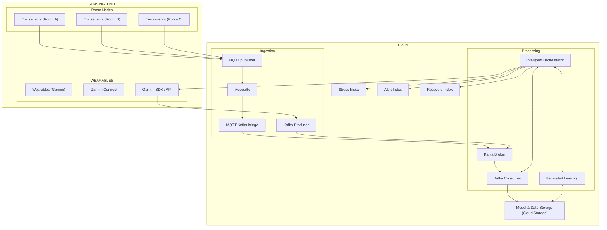

# ☁️ System Architecture Diagram

This diagram illustrates the complete data flow within the **Event-Driven Architecture (EDA)** system,  
from IoT room nodes and wearables up to cloud ingestion, processing, and federated learning components.

## 🧭 Description

Room Nodes: Environmental sensors deployed in multiple rooms publish data via MQTT.

Wearables: Garmin devices stream biometric data through the Garmin Connect SDK.

MQTT Broker: Acts as the ingestion layer for IoT messages.

Kafka Broker: Processes incoming data streams and distributes them to downstream services.

Intelligent Orchestrator: Performs analytics and computes key indices (Stress, Alert, Recovery).

Federated Learning Coordinator: Manages model updates across distributed nodes while preserving data privacy.

Cloud Storage: Central repository for models and processed data.