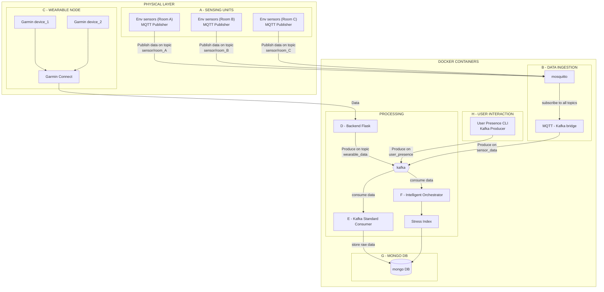

# ☁️ System Architecture Diagram

## 🧭 System Description
The architecture follows an Event-Driven Architecture pattern, leveraging Docker containers to decouple data ingestion, message streaming, and intelligent processing.

1. Physical Layer (Data Sources)

[A] Sensing Units: Environmental sensors located in different zones (Rooms A, B, and C). These act as MQTT Publishers, broadcasting telemetry data to specific room-based topics.

[C] Wearable Node: Garmin devices (1 & 2) that sync via Garmin Connect. This node handles the initial collection of biometric data before sending it to the cloud backend.

2. Data Ingestion & Interaction

[B] Data Ingestion: A centralized Mosquitto broker receives all environmental MQTT traffic. An MQTT-Kafka Bridge subscribes to these topics and transforms the messages into Kafka events, producing them on the `sensor_data` topic.

[H] User Interaction: A dedicated User Presence CLI acts as a Kafka Producer, allowing manual or automated injections of user status data into the `user_presence` topic.

[D] Backend Flask: Serves as the entry point for wearable data. It processes incoming requests from the Garmin ecosystem and produces events on the `wearable_data` Kafka topic.

3. Processing & Streaming Layer

Kafka Broker: The central nervous system of the architecture. It manages the pub/sub logic for three main data streams: wearable data, sensor data, and user presence.

[F] Intelligent Orchestrator: A specialized consumer that pulls data from Kafka to perform real-time analysis, resulting in the computation of the Stress Index.

[E] Kafka Standard Consumer: A utility service dedicated to data persistence. It consumes raw data streams from Kafka to ensure they are backed up.

4. Storage & Persistence

[G] MongoDB: The primary persistent storage layer. It stores Raw Data: Handled by the Standard Consumer [E].
Processed Indices: Calculated values (like the Stress Index) sent from the Orchestrator [F].